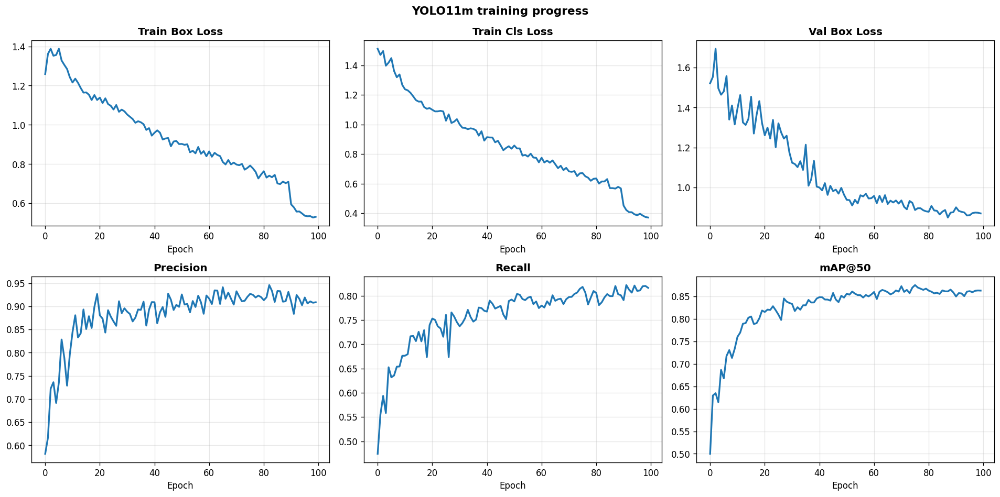
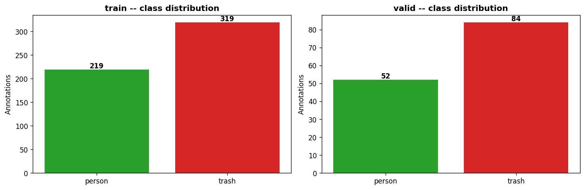
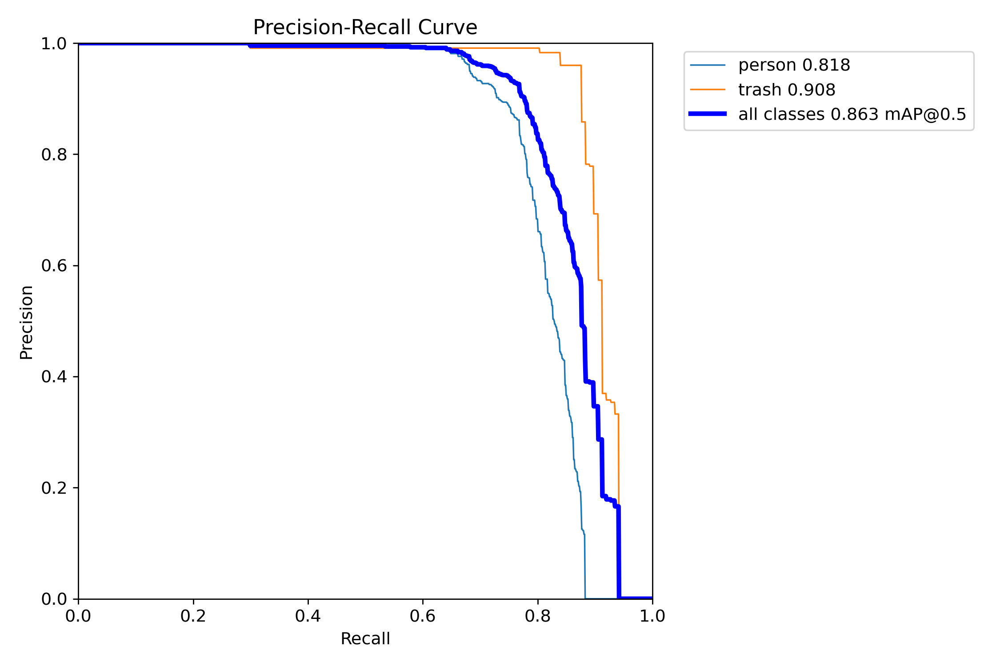
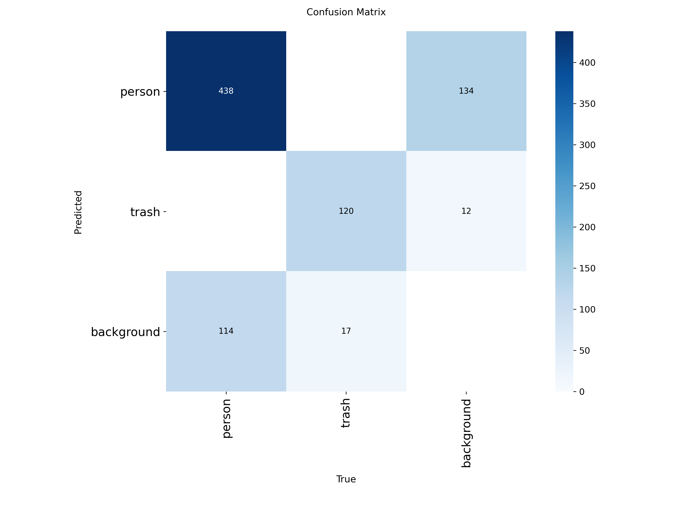

# Littering Detection from Fixed-Camera Video

> Detect possible littering events in fixed-camera (CCTV-style) video by combining
> object detection with lightweight temporal reasoning — no action-recognition model required.


A proof-of-concept computer-vision pipeline that flags short time windows where a person
most likely dropped a piece of trash. Instead of training a data-hungry action classifier,
it fine-tunes a YOLO detector on two classes (`person`, `trash`), tracks objects across
frames with ByteTrack, and applies a small set of **explainable temporal rules** to decide
when a littering event has occurred. Every alert can be traced back to the rule that fired
it, which makes the system easy to understand and easy to debug.

The whole pipeline lives in a single, well-organised notebook:
[`littering_detection.ipynb`](littering_detection.ipynb).

---

## How it works

The detector and tracker are used unmodified — the boxes you see in the output are exactly
YOLO + ByteTrack output. The contribution is the **event-trigger layer** on top:

1. **Silent calibration pre-pass** — before writing any frames, the system sweeps ~20 sampled
   frames in the first ~2 s and records trash that is *already* in the scene. Pre-existing
   trash never triggers an alert, even if its tracking ID changes later.
2. **New-trash detection** — any trash detection far enough from a known position becomes a
   candidate new object.
3. **Confirmation buffer + smoothed confidence** — a candidate must persist for several frames
   and keep a rolling-average confidence above a threshold, filtering out one-frame flickers.
4. **Proximity to a person** — an alert only fires when the trash is close to a person, measured
   as the minimum distance to the person's head, center, and feet, with a radius that scales
   with the person's box height.
5. **Carry-check** — if the trash sits in the upper portion of a person's box it is treated as
   *being held*; the alert waits until the item leaves the hand (i.e. the actual drop).
6. **Recent-event + per-track suppression** — prevents the same drop from firing twice (via an
   ID switch or co-detection) while still catching genuinely separate drops.

When all checks pass, the system draws a `! LITTERING DETECTED !` banner on the annotated
video, saves an evidence screenshot, and adds the event to a printed summary.

## Results

The fine-tuned YOLO11m model reaches roughly **0.90 precision**, **0.82 recall**, and
**0.86 mAP@50** on the held-out validation split. These are solid numbers for a small custom
dataset and are sufficient for the alert logic on top to be useful. The temporal-reasoning
layer is what turns raw detections into reliable, low-false-positive alerts.

| Training progress | Class distribution |
|---|---|
|  |  |

| Precision–Recall curve | Confusion matrix |
|---|---|
|  |  |

## Repository structure

```
littering-detection/
├── littering_detection.ipynb       # full pipeline: data prep → train → eval → inference
├── data.yaml                       # YOLO dataset config (template — bring your own data)
├── requirements.txt
├── docs/images/                    # charts used in this README
├── LICENSE
└── README.md
```

When you run the notebook it auto-creates the working folders it needs next to itself
(`input/`, `outputs/`, `evidence/`, `graphs/`, `dataset_merged/`, `extra_data/`,
`littering_model/`, `train/`, `valid/`). These hold your data and results and are
intentionally git-ignored.

## Installation

```bash
git clone <your-fork-url> littering-detection
cd littering-detection
python -m venv .venv && source .venv/bin/activate   # optional
pip install -r requirements.txt
```

A CUDA GPU is recommended for training and faster inference; the notebook also runs on
Apple Silicon (MPS) and CPU (slower, and training epochs are auto-reduced).

## Usage

Open `littering_detection.ipynb`. A single configuration cell at the top controls
every stage via skip flags (`SKIP_INSTALL`, `SKIP_DOWNLOAD`, `SKIP_MERGE`, `SKIP_TRAIN`,
`SKIP_EVAL`) and exposes all detection thresholds.

**1. Bring your own data.** Place a YOLO-format dataset under `train/` and `valid/`
(`images/` + `labels/`). Polygon and bounding-box labels are both supported — the notebook
normalises polygons to boxes automatically.

**2. (Optional) Add external data.** Set `SKIP_DOWNLOAD = False` to pull ~600 images from
Open Images V7 via FiftyOne (Person / Bottle / Tin can / Plastic bag / Waste container,
remapped to `person` / `trash`) for extra visual variety.

**3. Get a model.**
- **Train your own:** set `SKIP_TRAIN = False` and run the training section.
- **Use the released weights:** download `best.pt` from the
  [Releases page](../../releases) and place it at
  `littering_model/yolo11m_littering/weights/best.pt`, then leave `SKIP_TRAIN = True`.

**4. Run detection.** Drop one or more videos (`.mp4`, `.avi`, `.mov`, `.mkv`, `.m4v`) into
`input/` and run the inference section. For each video you get an annotated `.mp4` in
`outputs/`, one evidence JPG per event in `evidence/`, and a printed summary.

## Dataset note

The dataset used in the original project was collected and annotated privately and is **not**
included in this repository. The repository ships only the code, configuration, and
documentation — bring your own YOLO-format data and/or use the optional Open Images download.

## Limitations

This is a proof-of-concept, not a finished surveillance product:

- Designed for a **fixed camera**; not for moving or pan-tilt cameras.
- Assumes **adequate daytime lighting**; low-light/night footage degrades detection.
- Very small or transparent trash (small wrappers, clear plastic) can be missed.
- In cluttered indoor scenes, some objects (shoes, hands, chairs, chargers) may be mis-detected
  as trash because the `trash` class is intentionally broad.
- Strong occlusion can hide the trash or the person and reduce reliability.
- Wind-displaced trash that drifts far from its calibration position may be re-flagged.
- In crowded scenes the **nearest-person** association may attribute a drop incorrectly.
- It flags **possible** events, not confirmed intent — a human should verify each alert.

## Future work

- More training data across camera angles, lighting, floor types, and outdoor scenes.
- Stronger trackers (e.g. BoT-SORT) to reduce ID switching in busy scenes.
- A lightweight action-recognition head to confirm the throwing motion when a drop is suspected.
- Instance segmentation for thin/overlapping trash.
- Better person–object association in multi-person scenes.
- Edge deployment (e.g. NVIDIA Jetson) and a review dashboard for operators.

## Acknowledgments

Developed as a university Computer Vision course project by **Fares Aldeeb**,
**Baraa Alsaker**, and **Abdurahman Ghannam**.

Built on excellent open-source work:

- [Ultralytics YOLO11](https://docs.ultralytics.com/models/yolo11/) — detection, training, and ByteTrack tracking
- [ByteTrack](https://arxiv.org/abs/2110.06864) — multi-object tracking
- [Open Images V7](https://storage.googleapis.com/openimages/web/index.html) — optional external training data
- [FiftyOne](https://docs.voxel51.com/) — dataset download and conversion
- [OpenCV](https://opencv.org/) and [PyTorch](https://pytorch.org/)

## License

Released under the **GNU Affero General Public License v3.0** (AGPL-3.0) — see
[`LICENSE`](LICENSE). This matches the license of Ultralytics YOLO, on which the project is built.
